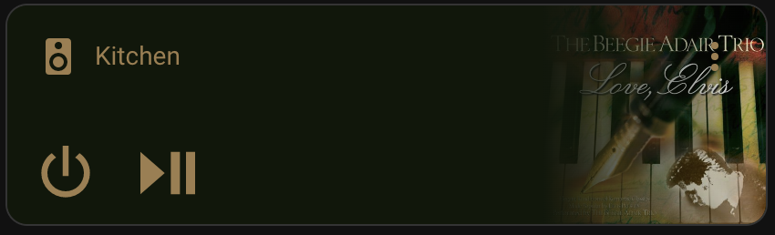

# Autonomic e-Series integration for Home Assistant

NOTE: This integration **REQUIRES** [Home Assistant](https://www.home-assistant.io/) version `2023.6.0` or greater.

Provides support for controlling Autonomic Controls e-Series media systems (either paired with Amps or not) through Home Assistant. Requires Autonomic e-Series servers running firmware `6.1.20180215.0` or greater.

Currently Supports:

- Home Assistant UI configuration.
- [ZeroConf](https://www.home-assistant.io/integrations/zeroconf/) MMS discovery.
- One `media_player` object per Autonomic Zone.
- Entity names follow Zone numbers.
- Power, volume, mute and source selection.
- Media transports.
- Playing meta-data including Art.
- Zone grouping.

Future plans:
 - Content browsing.

>## IMPORTANT NOTE if upgrading from versions v2024.01.0 or lower
>This integration has been entirely re-written which results in a few **Breaking Changes**:
> - Before using this updated version you'll need to remove the configuration entry from your `configuration.yaml` file. There should be NO references to `autonomic` in your config file.
>
> - Default entity names in `MRAD_MODE` have been changed.  These used to be in the form `media_player.{{zoneName}}` such as `media_player.kitchen` but are now in the form `media_player.{{model}}_zone_{{zoneNumber}}` such as `media_player.mms5e_zone_01`.  You can re-name your entities once the new integration is installed to fix any missing references you may encounter.
>
> - The `media_player.autonomic_all_off` service is now a `button` entity named `button.{{model}}_all_off` such as `button.mms_5e_all_off`.
>
>----
>

## Installation

### Before Installation
 - Configure and test your Autonomic system according to the manufacturers directions first.
 - Be sure to give a name to any/all zones you plan on using.

### Installation via HACS
 - Install [HACS](https://hacs.xyz/) if you haven't already done so.
 - Add this repo to HACS as a custom repo.
 - Note that HACS will prompt you to restart Home Assistant. Do that.
 - Home Assistant should discover your MMS system and suggest this driver for configuration, if not you can search for the `Autonomic eSeries` integration in the `Settings \ Integrations \ + Add Integration` Home Assistant UI. Provide the IP address of your matrix switch when prompted.

### Manual installation
Copy the `custom_components/autonomic` directory to your `custom_components` folder. Modify your `configuration.yaml` as below and restart Home Assistant.

## Modes of operation

### Amplifier detected (MRAD mode):

This mode applies when an Autonomic amplifier is detected by this integration.

* `media_player` objects in Home Assistant created as part of a MRAD mode system always have `power` and `volume` controls.

* When the `switch.{{model}}_group_volume` is OFF, volume commands are for a single specified zone.

* When the `switch.{{model}}_group_volume` is ON, volume commands for a specified zone are applied to that zone ***and*** all other zones that are currently selecting the same source.

Consult your Autonomic configuration.

### No Amp detected (Standalone mode):

This mode applies when you only have an Autonomic eSeries Media Player.

* `media_player` objects in Home Assistant created as part of a Standalone Media Player never have `power` controls and only have `volume` controls if ***not*** configured to have `fixed` volume.

Consult your Autonomic configuration.

